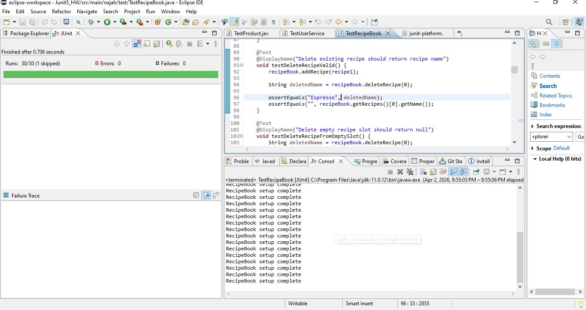
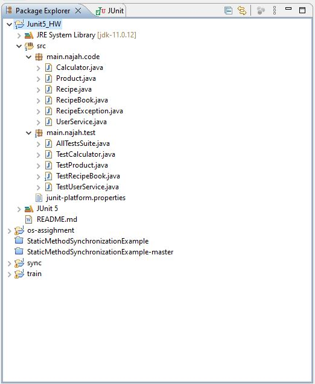

JUnit5 Homework
# JUnit5 Homework 2

This repository contains my solution for Homework Assignment #2 in Software Testing and Quality Assurance.

## Included Work
- Test classes for Calculator, Product, UserService, and RecipeBook
- Test suite using @Suite
- Parameterized tests
- Timeout tests
- Ordered tests
- Lifecycle hooks
- Disabled failing test
- Parallel execution
- Screenshots for JUnit results and coverage

## Screenshots

### JUnit / Coverage

### Runs

### Package Explorer

